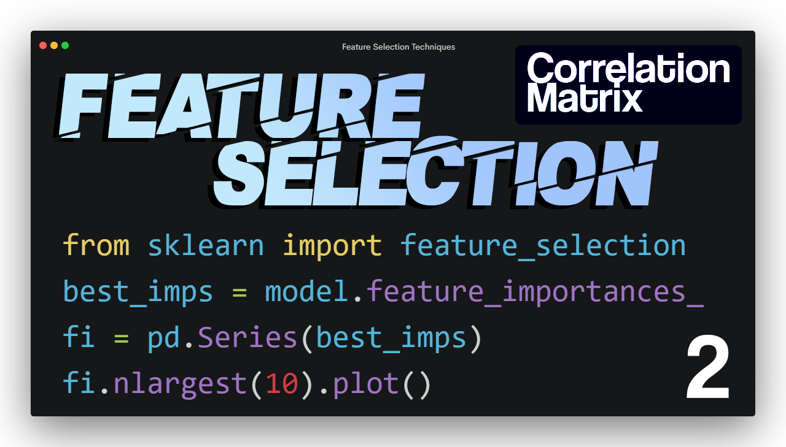
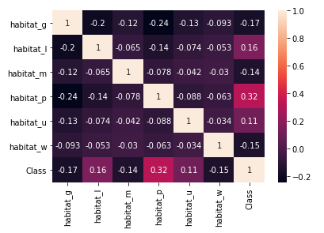
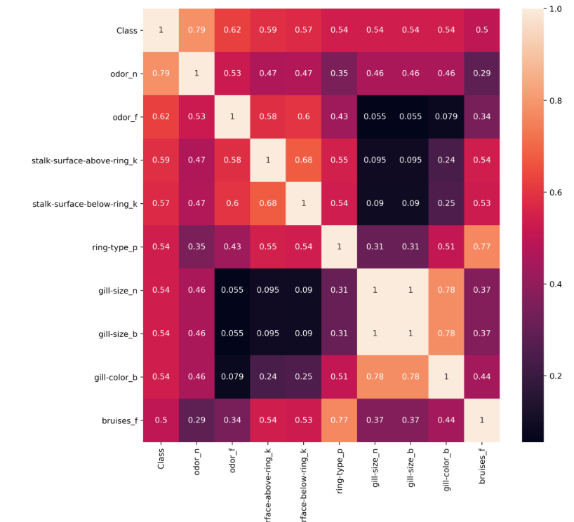

# Feature_Selection

<p align="center"></p>

## Projects - List of Context:

### 1. Feature Importance

* [Codes and Full Article](https://github.com/cobanov/Feature_Selection/tree/master/Feature%20Importance)
* [YouTube Video](https://www.youtube.com/watch?v=z5dXpdGaU60)


### 2. Correlation Matrix

* [Codes and Full Article](https://github.com/cobanov/Feature_Selection/tree/master/Correlation_Matrix)
* [YouTube Video](https://youtube.com/MertCobanov)


## Dataset:
* [Mushroom Dataset - Kaggle](https://www.kaggle.com/uciml/mushroom-classification)


# Projects:
## 1. Feature Importance

<p align="center"></p>

Genellikle bir makine öğrenmesi projesine başlarken çalışacağınız veri istediğiniz formatta ve modele uygulanmaya hazır bir şekilde değildir. Farklı uzantılarda ve yapılarda olabilir. (CSV, JSON, Excel veya DB etc.) Ayrıca veriseti kendi içerisinde eksik, anormal veya gereksiz bilgiler de içeriyor olabilir. Aynı zamanda modelinizde kullanacağınız veriye ön hazırlıklar yapmanız gerekebilir, örnek vermek gerekirse ölçeklendirme veya normalleştirme sayılabilir.

Her şeye rağmen bu işlemleri tamamladığınızda dahi modelinizin iyi bir performans göstermesi için boyutsallığının azaltılması ve güçlü ilişkilere sahip parametrelerin, performansı kötü etkileyecek diğer parametrelerden ayrılması gerekir. Çünkü bu öznitelikler (features) modele bir bilgi getirmiyor olabilirler.

Bu yüzden bir veri bilimci veya makine öğrenmesi mühendisinin en önemli yetkinlikleri aslında bu verinin önişlemlerini gerçekten iyi yapmasından geçmektedir. Bu seride güncel olarak kullanılan Feature Selection yani öznitelik seçimlerinde kullanılan etkili metodları inceliyor olacağız. Teoride daha fazla öznitelik eklenmesi modelin gelişimi için daha iyidir fakat pratikte bunun tam tersi geçerlidir. Bu önerme aslında hem doğru hem de yanlıştır, çünkü modele getirdiğiniz her özellik bilgi taşıyan ve önemli bir parametre olması gerekir. Burada optimum değeri yakalamak önemli, tabii ki curse of dimensionality yani boyutsallığın laneti konusuna da dikkat etmemiz gerekir.

Pekala boyut düşürmenin veya öznitelik azaltmanın yararları nedir:
* Daha yüksek doğruluk oranı
* Overfitting probleminin önüne geçmek.
* Model eğitim süresinin kısaltılması.
* Daha etkin bir görselleştirme
* Daha açıklanabilir bir model.

Burada kullanacağımız veri seti "Mushroom Classification" yani "Mantar Sınıflandırma" veri seti olacak. Kullanacağımız kütüphaneler tahmin edebileceğiniz gibi:
* Pandas
* Numpy
* Matplotlib
* Seaborn
* Sklearn 

## Imports

```python
import pandas as pd 
from sklearn.preprocessing import LabelEncoder
from sklearn.preprocessing import StandardScaler
from sklearn.model_selection import train_test_split
```

```python
data = pd.read_csv("mushrooms.csv")
data.head()
```

## Dataset Prep.

Veri setini ve başlangıç parametrelerimizi hazırlayalım. Burada verisetimizdeki her bir kolonu one_hot_encoding yöntemiyle encode edeceğim.

[https://www.kaggle.com/uciml/mushroom-classification](https://www.kaggle.com/uciml/mushroom-classification)

```python
X = data.drop(['class'], axis=1)
y = data['class']

X_encoded = pd.get_dummies(X, prefix_sep="_")
y_encoded = LabelEncoder().fit_transform(y)
X_scaled = StandardScaler().fit_transform(X_encoded)

X_train, X_test, y_train, y_test = train_test_split(X_scaled, y_encoded, test_size = 0.30, random_state=101)
```

## Feature Selection Techniques

### Feature Importance

Karar ağaçları çeşitli özniteliklerin önem derecelerini sıralamak için kullanılabilir. Karar ağaçlarındaki dallanma bildiğiniz gibi özniteliklerin sınıflandırıcılığıyla belirlenir. Bu yüzden daha çok kullanılan nodelar daha yüksek öneme sahip olabilirler. 

```python
import time
from sklearn.metrics import classification_report,confusion_matrix
from sklearn.ensemble import RandomForestClassifier
```

```python
start = time.process_time()

model = RandomForestClassifier(n_estimators=700).fit(X_train, y_train)

print(time.process_time() - start)

preds = model.predict(X_test)

print(confusion_matrix(y_test, preds))
print(classification_report(y_test, preds))
```

2 saniye gibi bir sürede modelin eğitimi tamamlandı.

```python
1.78125
[[1274    0]
 [   0 1164]]
              precision    recall  f1-score   support

           0       1.00      1.00      1.00      1274
           1       1.00      1.00      1.00      1164

    accuracy                           1.00      2438
   macro avg       1.00      1.00      1.00      2438
weighted avg       1.00      1.00      1.00      2438
```

Tam bir başarı oranına sahibiz fakat burada bakacağımız konu aslında hangi niteliklerin ne kadar önemli olduğu. Bu yüzden feature importance metoduyla eğitilmiş modelin en önemli olduğu 10 parametreyi görselleştiriyorum.

```python
import matplotlib.pyplot as plt
from matplotlib.pyplot import figure
```

```python
feature_imp = pd.Series(model.feature_importances_, index= X_encoded.columns)
feature_imp.nlargest(10).plot(kind='barh')
```


Şimdi tüm kolonları kullanmak yerine sadece önemli olarak gördüğüm 4 parametreyle eğiteceğim.

```python
best_feat = feature_imp.nlargest(4).index.to_list()

X_reduced = X_encoded[feature_imp.nlargest(4).index]
Xr_scaled = StandardScaler().fit_transform(X_reduced)

Xr_train, Xr_test, yr_train, yr_test = train_test_split(Xr_scaled, y, test_size = 0.30, 
                                                        random_state = 101)

start = time.process_time()
rmodel = RandomForestClassifier(n_estimators=700).fit(Xr_train,yr_train)
print(time.process_time() - start)

rpred = rmodel.predict(Xr_test)
print(confusion_matrix(yr_test, rpred))
print(classification_report(yr_test, rpred))
```

```python
0.84375
[[1248   26]
 [  53 1111]]
              precision    recall  f1-score   support

           e       0.96      0.98      0.97      1274
           p       0.98      0.95      0.97      1164

    accuracy                           0.97      2438
   macro avg       0.97      0.97      0.97      2438
weighted avg       0.97      0.97      0.97      2438
```

Çok açık bir şekilde görebiliriz ki, eğitim süresi yarı yarıya inerken accuracy'den çok az kaybettik. Aslına bakarsanız bu çok küçük bir veriseti kazancımız 1 saniye kadar fakat bunu milyonlarca satıra sahip bir verisetiyle saatlerce eğittiğiniz bir model olduğunu düşünürseniz kesinlikle gireceğiniz bir tradeoff olacaktır.

Bir sonraki derste Recursive Feature Elimination (RFE) tekniğini göreceğiz. 

İyi çalışmalar dilerim.

## 2. Correlation Matrix

<p align="center"></p>

Feature Selection çalışmalarına Correlation Matrix ile devam ediyoruz. Veriye bakış açımız ve uyguladığımız her tekniğin bir istatistiksel altyapısı olması gerekir. Yapacağımız işlemlerin her birini model performansını artırmaya yönelik ve belirli bir sistematik ile yapmak başarımı en çok etkileyen unsurlardandır. Genel olarak featurelarımızın, target ile ilişkisini ölçmek için en popüler tekniklerden olan korelasyon matrisi bize basitçe kolonların birbiri ile olan ve hedef ile olan ilişkisini gösterir. Genel bir yaklaşım olarak "-0.7"den küçük ve "+0.7"den büyük korelasyon değerleri güçlü korelasyonu temsil etmektedir. Buradaki amacımız çıkış ile ilişkisi olmayan ve bilgi taşıma potansiyeli görece diğer kolonlara az olan featureları elemek olmalıdır. Bu sayede ilk derste verdiğimiz daha sade ve etkili model, hızlı eğitim gibi başarımı pozitif yönde etkileyecek unsurlara sahip olabilir. 

Şimdi python'da korelasyon matrisi nasıl oluşturulabilir buna bakalım. 

Geliştirici Notu:
Tüm kolonları ordinal olmayan kategorik verilerde korelasyon analizi mantıklı bir yaklaşım olup olmadığı tartışmaya açık bir konudur. Burada bahsi geçen veri seti veya amaçtan ziyade, korelasyon matrisinin tekniklerini ve anafikrini yakalama için uygun sayılabilir diyebiliriz. !! Genellikle !! regresyon işlemlerinizde ve sayısal bir değer içeren kolonlarda kullanılması şiddetle önerilir.

## Imports
```python
import pandas as pd 
from sklearn.preprocessing import LabelEncoder
from sklearn.preprocessing import StandardScaler
from sklearn.model_selection import train_test_split
```

Veri setini hazırlıkları yapmak adına içeri aktaralım.

```python
data = pd.read_csv("../mushrooms.csv")
data.shape
```

İlk yapacağımız işlem veri setimiz harflerden oluştuğu için bunu sayısal bir forma çevirmek olmalı, buradaki yaklaşımımız featureları one-hot encoding yaptıktan sonra standardize etmek. Y kolonumuzu label encoding yaparak korelasyon haritasını oluşturmak için featurlarımızın olduğu dataframe'in sonuna ekleyeceğiz.

```python
X = data.drop(['class'], axis=1)
y = data['class']
X_encoded = pd.get_dummies(X, prefix_sep="_")
y_encoded = LabelEncoder().fit_transform(y)
X_encoded["Class"] = y_encoded

X_encoded.corr()
```

Dataframe üzerinden bu verilerin okunması oldukça zor, seaborn kütüphanesindeki heatmap grafiği bizim için bu dağılımı renkler ve anlaşılması kolay bir görselle açıklayacak. Verisetimizin eğer tamamınız alırsak şu anki durumda 118 kolon var, bunun çizdirilmesi mantıkl değil, sadece son 7 kolonu alarak şu anlık gözlemleyelim. Birazdan öğreneceğimiz teknikler ile en önemli 10 parametreyi görselleştiriyor olacağız.

```python
sns.heatmap(X_encoded.iloc[:, -7:].corr(), annot=True)
```


Belirttiğimiz gibi eksi ve artı değerler güçlü korelasyonu ifade ediyor, burada sayının pozitif ve negatif olması ilişkinin ters veya doğru orantılı olarak değişmesi ile alakalı, her ikisi de bizim için iyi featurelar olabilir bu yüzden dataframe'in mutlak değerini alarak en yüksek değerli olanları getireceğiz.

```python
X_encoded.corr().abs()["Class"]

# .nlarget ile sıralı bir şekilde en yüksek 10 değeri alabiliriz.
X_encoded.corr().abs()["Class"].nlargest(10)
```

Bu zamana kadar yazdığımız kısmın sonunda index metodunu ekleyerek sadece kolon isimlerini istiyorum ve bunu ana datasetimizden başka bir değişkene aktarıyorum. Birazdan sadece bu kısmı kullanıyor olacağız, bu sayede daha okunaklı ve en yüksek 10 korelasyon değerine sahip kolon ile birlikte çalışıyor olacağız.

```python
X_reduced_col_names = X_encoded.corr().abs()["Class"].nlargest(10).index
X_encoded[X_reduced_col_names].corr()
```

Artık görselleştirme kısmına geçebiliriz. Çizdirdiğimiz görselin büyüklüğü ve çözünürlüğünü değiştirmek adına matplotlib kütüphanesini içeri aktarıyorum. figsize ile boyut, dpi ile çözünürülük ayarlanabilmektedir. heatmap içindeki "annot" ile karelerin içerisine değerlerini yazdırabiliyorum.

```python
import matplotlib.pyplot as plt

plt.figure(figsize=(10, 10), dpi=400)
sns.heatmap(X_encoded[X_reduced_col_names].corr().abs(), annot=True)
```


